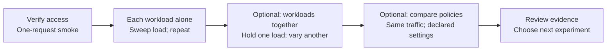

# Inference benchmark harness

Run bounded AIPerf tests against an existing streaming Chat Completions endpoint. Preserve each attempt and validate it before continuing.

## What this measures

Measure how load and competing workloads affect p95 time to first token, p95 request latency, request throughput and errors. Use the results to choose a workload's usable load range and compare serving policies under matched traffic.



The operator chooses the next experiment and changes serving settings. The harness runs the declared points, validates each attempt, preserves failures and checkpoints accepted repeats. Metrics and routing evidence determine which claims the measurements support.

## Where to start

| Need | Start here |
|---|---|
| Get a first test running | [Daniel's standalone AIPerf guide](https://github.com/dandawg/llm-d-flow-control-demo/blob/main/benchmarks/standalone-guide.md). His [demo repository](https://github.com/dandawg/llm-d-flow-control-demo) also provides a deployment scaffold |
| Run repeatable experiments | This harness checks inputs, runs isolated or mixed workloads, repeats measurements and preserves evidence |
| Use an AI agent to operate or modify the harness | [Agent instructions](AGENTS.md) link the workflow, evidence rules and contributor checks |
| Understand the shared-GPU business case and prior experiments | [Alexa's decision guide](https://alexagriffith.github.io/flow-control-benchmarks/benchmark-decision-map/) and [benchmark repository](https://github.com/alexagriffith/flow-control-benchmarks) cover experiment choices, prior results and their evidence limits |
| View benchmark progress or replay an experiment | [Flow Control Visualizer & Dashboard repository](https://github.com/alexagriffith/flow-control-visualizer). The [progress dashboard](https://github.com/alexagriffith/flow-control-visualizer#follow-a-benchmark) reads AIPerf outputs and harness checkpoints; animated replay requires [compatible CSV artifacts](docs/operator-guide.md#viewer-inputs). Both views are read-only |
| Understand or configure the serving stack | [llm-d](https://github.com/llm-d/llm-d), [documentation](https://llm-d.ai/docs) and [router / flow control](https://github.com/llm-d/llm-d-router) |

## Install and configure

`benchmark.local.json` is the settings file for **one workload**: endpoint URL, model, authentication, prompts, load limits and optional metrics/goals. Create it below; verification, smoke and benchmark all read it. A **matrix** is a separate, optional file that coordinates workload configs into experiments.

Python **3.11–3.13**, Git and Make on Linux or macOS. AIPerf is pinned to 0.12.0 and does not support Python 3.14. Use a supported interpreter for `python3` below. The local config and `results/` directory below are ignored by Git.

```sh
git clone https://github.com/rh-aiservices-bu/inference-benchmark-harness.git
cd inference-benchmark-harness
python3 -m venv .venv
. .venv/bin/activate
python -m pip install '.[runtime]'
```

Create the config once. Use the existing inference URL and served model name; this does not change their deployment.

```sh
make configure ARGS='--url http://localhost:8000 --model served-model'
```

This creates `benchmark.local.json` without sending traffic or overwriting an existing file. Add `--api-key-env INFERENCE_TOKEN` when bearer authentication is required. Set the token in your environment, not in the file. You can instead copy `examples/benchmark.json` to `benchmark.local.json` and edit JSON directly.

| Input | What to supply / default |
|---|---|
| Connection | Your endpoint URL and model; authentication and routing headers when required |
| Workload | Generated single-turn prompts (128 input / 64 output tokens), or `--prompts /path/prompts.jsonl` with one `text` field per row. No multi-turn or tool calls |
| Load | Concurrency `1,2,4`, three repeats. Use `--concurrency 1` for one point; these are example loads, not calibrated limits |
| Budget | Per repeat: 20 requests or 60 seconds of sending, whichever comes first; 30-second request timeout, 35-second drain grace, 180-second process deadline |
| Metrics | Empty by default: **no server metrics collected or checked**. Client timing still works. Supply producer URLs and required names before making flow-control claims |
| Goals | Empty by default: collect measurements without declaring a latency target pass |

[Every configuration field, flag, default and time limit](docs/configuration.md). Unknown JSON fields are rejected with their field path. Review these settings before traffic. Use representative workloads and larger budgets for performance claims.

## Run

Use **verify → smoke → benchmark**. All three read `benchmark.local.json`; no matrix or latency goal is required.

1. **Verify the setup.** Validate the config and check AIPerf, authentication, the configured model listing and metric endpoints. No inference traffic is sent.

   ```sh
   make verify
   ```

   The config tells verification what to check. Continue at `ready_for_smoke`, after reviewing any `unverified` checks. Empty `metrics` skips collection checks; without a model-list API, smoke must confirm inference access.

   In a terminal, verification shows green **PASS**, yellow **WARN** and red **FAIL** labels. WARN means unverified or not configured; FAIL blocks progress. Redirected output stays JSON. Use `make verify FORMAT=text` to force readable output even when redirected or `make -s verify FORMAT=json > verification.json` to save checks, discovered names and timestamps. `NO_COLOR=1` disables color.

2. **Send one test request.** Smoke repeats the setup checks, sends one short synthetic request and validates its saved evidence. Read the result before continuing.

   ```sh
   make smoke
   make report RUN=results/smoke
   ```

   This checks the request path, not capacity or full warmup. Establish [cache/warmup and drain conditions](docs/operator-guide.md#run-sequence) before measuring.

3. **Run the benchmark.** Confirm the configured load points, repeats and request/time limits. Smoke saves to `results/smoke`; the benchmark saves to `results/benchmark`. Existing results are never overwritten.

   ```sh
   make benchmark
   make report
   ```

   Each attempt checks the setup, runs AIPerf, validates evidence and saves its outcome. An incomplete or unsuccessful campaign returns nonzero. `complete` without goals does not establish suitability. Preserve failures and use [debugging](docs/operator-guide.md#debugging) before retrying.

**Optional preview:** `make plan` prints the benchmark commands and maximum request budget without running anything. `make plan-smoke` does the same for the one-request smoke. Neither is a required execution step; smoke saves its actual command automatically.

For another experiment, use `make benchmark CONFIG=/path/other.json RUN=/path/new-results`. Choose durable storage appropriate to your run environment.

`make help` lists commands. `benchmark` is an alias for `sweep`. Preflight requires direct endpoint URLs and refuses redirects, including login redirects.

The example uses **three valid repeats per point**. Invalid evidence stops immediately. A valid goal miss or request error is retained. Remaining repeats at that point finish before higher load is stopped. Inference is never automatically retried. See [recovery](docs/operator-guide.md#recovery) before using `make resume`.

## Choose your experiment

A matrix is optional. Edit the `load` block in your workload config:

| Run | Set | Command |
|---|---|---|
| One load point | `"concurrency": [4]` | `make benchmark` |
| Several points in sequence | `"concurrency": [1, 2, 4]` | `make benchmark` |
| A different workload or your next manual step | A separate config and new results directory | `make benchmark CONFIG=/path/next.json RUN=/path/results/next` |
| Workloads together | Named workload configs and a matrix | `make matrix-run MATRIX=/path/matrix.json RUN=/path/results/mixed` |

`load.repeats` controls measurements at each point; set it to `1` for one measurement or `3` for three. For request-rate tests, use `rates` instead of `concurrency`, with `arrival` and `max_concurrency`; see [load settings](docs/operator-guide.md#configuration-ownership). Goals are optional in every path.

## Several workloads or experiments

The matrix generator takes **workload config files, the load to change, its values, fixed loads for other workloads, and repeats**. This example changes background concurrency while keeping interactive concurrency at one:

```sh
make matrix-create ARGS='--output /path/matrix.json --name mixed-check --question "How does background load affect interactive traffic?" --stream interactive=/path/interactive.json --stream background=/path/background.json --sweep background --axis concurrency --values 1,2,4 --hold interactive=1 --repeats 3'
```

This creates three rows with three repeats each. Values are illustrative, not calibrated limits. The workload files supply endpoint, prompts, budgets and optional goals. The generator validates inputs and prints the request budget; it sends no traffic. [Generator options](docs/operator-guide.md#generate-a-matrix).

For custom multi-stage or policy experiments, see [matrix fields](docs/configuration.md#custom-matrix-json). Existing workload configs can be referenced by path; no prescribed folder layout is required. The matrix runs each row's streams together and checkpoints whole repeats.

```sh
make matrix-plan MATRIX=/path/matrix.json RUN=/path/results/matrix
make matrix-run MATRIX=/path/matrix.json RUN=/path/results/matrix
make report RUN=/path/results/matrix
```

Every stream uses the same verify/smoke preparation before coordinated load.

`matrix-pause` finishes the current group before pausing. `matrix-resume` rechecks inputs and continues after accepted groups. Use the same `MATRIX` and `RUN`. Invalid peers or insufficient traffic overlap invalidate the whole repeat. See [matrix configuration and policy comparisons](docs/operator-guide.md#matrix-configuration). If a crash interrupts finalization after the last row, resume verifies accepted evidence and finalizes the status without replaying traffic.

## Scope and evidence

One workload config describes one stream. A matrix combines streams and explicit experiments, with optional observed serving-profile gates for detector/filter comparisons. The harness does not deploy, scale or choose serving parameters. No KServe, OpenShift or Prometheus database is required. Multi-turn, tools, Responses API, arrival-time replay and New Relic querying are outside this package.

Results retain native AIPerf files, config, commands, checks, summaries and timestamped provenance. Native files may contain prompts and operational data. Keep them in your environment and select what to share. [Storage and timestamps](docs/operator-guide.md#evidence-and-storage).

Before handoff, follow the [qualification checklist](docs/operator-guide.md#handoff-check). Keep this README as the command entry point, the [operator guide](docs/operator-guide.md) for decisions/configuration/recovery, and the [metric reference](docs/metrics.md) for names, units and purpose.

## Test

```sh
make test
make test-integration AIPERF=/path/to/aiperf
make test-matrix AIPERF=/path/to/aiperf
```

Integration uses real AIPerf against a local simulated server, with no GPU or cluster. It checks payloads, authentication, pacing, repeats, metric collection and failure handling. It does not establish model performance or deployment compatibility. [Container and Job instructions](docs/operator-guide.md#execution-environment).

[Writing walkthroughs](docs/writing-guide.md)

Apache-2.0. AIPerf is a separate dependency with its own license.
